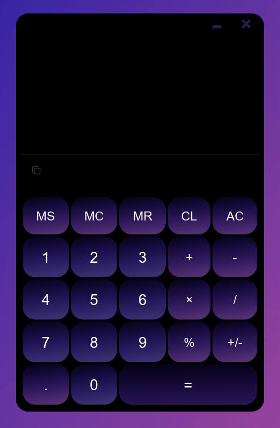
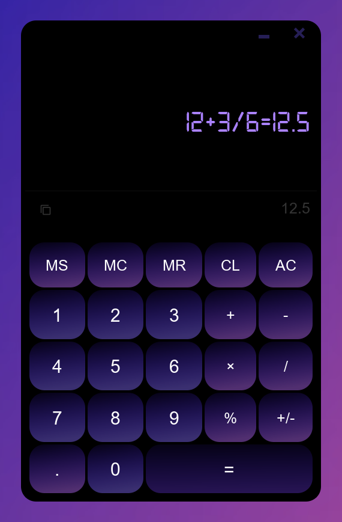
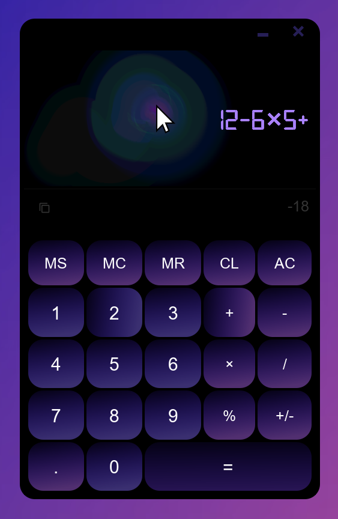
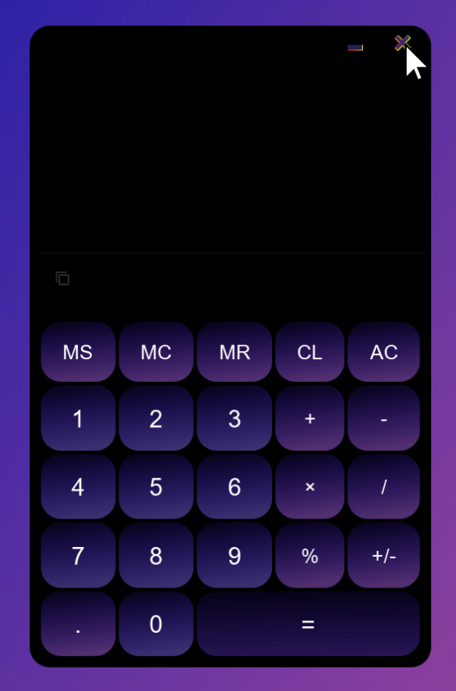

# Calculator-Swing-Java
It is a simple application that provides the user with an interface to perform various mathematical operations. This application is written in Java Swing, making it cross-platform and easy to use.

Main functions:

1. Perform basic arithmetic operations (addition, subtraction, multiplication, division, percentages).
2. Working with memory (entering numbers into memory, retrieving numbers from memory, clearing memory).
3. Simple and clear interface.

The calculator can be useful for students, engineers, scientists and anyone who needs to perform mathematical operations quickly and accurately. This application will help you save time and improve the accuracy of calculations.

   
